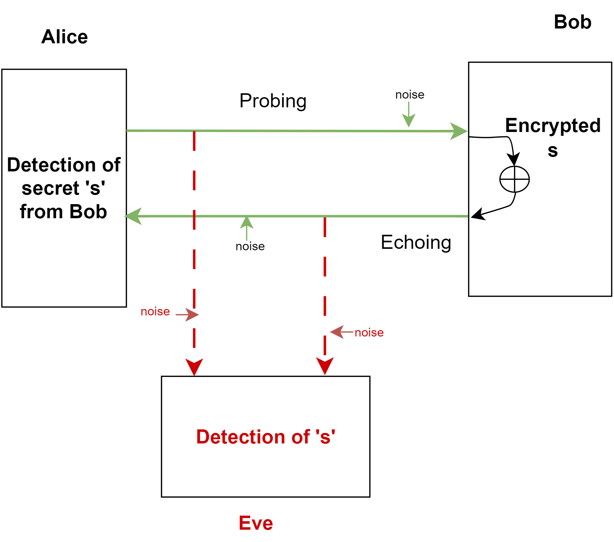
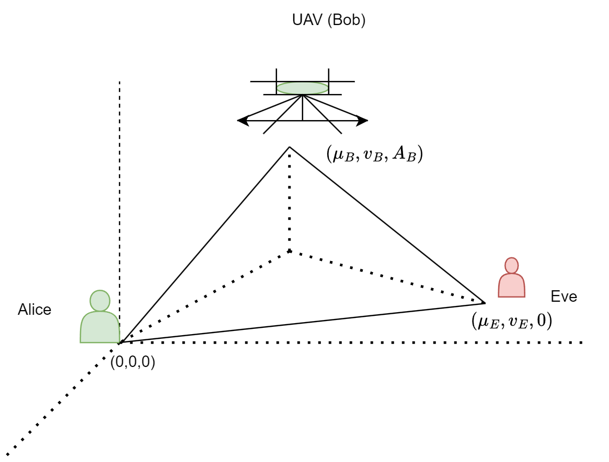
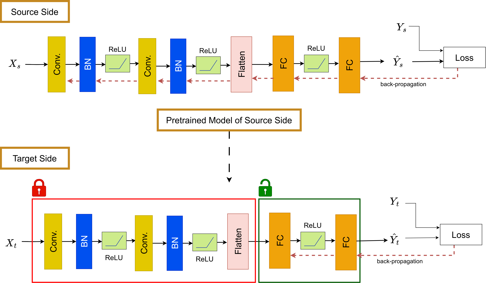
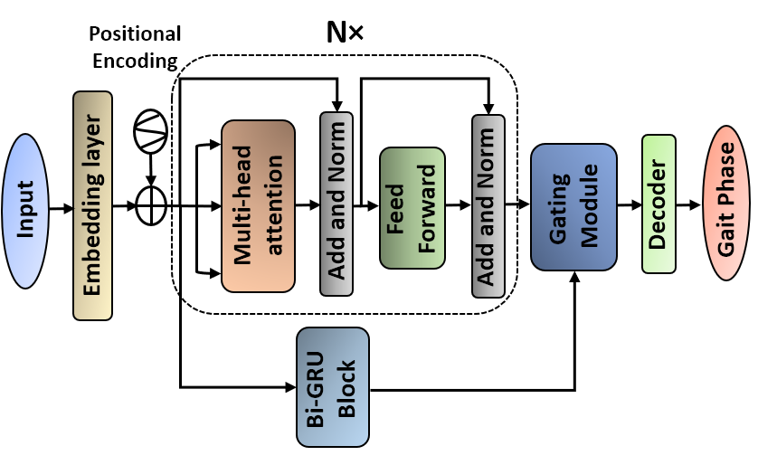

   
<h3 style="color: #0f0e0e;">Security with novel STEEP in Wiretap Channel</h3>  <a href="https://arxiv.org/abs/2403.06438" style="color: blue;">ICC'24</a> 

"STEEP" enables secure message transmission in a MISO fading channel from Alice to Bob, even when Eve's channels are stronger. It unifies principles in wiretap channel transmission and secret key generation, superseding any known models for guaranteed positive secrecy against stronger eavesdroppers. The principle of STEEP consists of two phases of interdependent operations: phases 1 and 2. In phase 1, a node (Alice) sends random probing symbols (also called probes) over a probing channel to another node (Bob). In this phase, Bob obtains some estimates of the probes, which could be noisy. While the estimates of the probes by Eve cannot be noiseless, they are allowed to be less noisy than those by Bob.  

In phase 2, Bob echoes back his estimated probes encrypted by a secret message meant for Alice via a return channel. Since Alice knows the exact probes, the effective wiretap channel system from Bob to Alice and Eve, relative to the secret message from Bob, is such that the effective return channel from Bob to Alice is stronger than that from Bob to Eve, subject to a sufficient amount of power from Bob.  STEEP does not require full-duplex, channel reciprocity, or knowledge of Eve's channel state information, yet it can achieve a positive secrecy rate as long as Eve's channel is not noiseless. This paper provides insights into the statistical behaviors of STEEP's secrecy capacity under random channel fading and compares it with conventional half-duplex two-way schemes. The analysis shows that STEEP can maintain a positive secrecy rate even when Eve's channel is stronger than the main channel, a property not available in prior schemes. The paper includes theoretical analysis, computer simulations, and comparisons to demonstrate the effectiveness and robustness of STEEP in various scenarios.
 

 

<h3 style="color: #0f0e0e;">Unmanned Aerial Vehicle Against Jamming</h3>  
In this UAV communication against jamming, we first consider a network as illustrated in Fig. Here Alice and Eve are ground stations with \( n_A \) and \( n_E \) antennas respectively. Eve is capable of jamming and receiving in full-duplex. Bob is the UAV with a single antenna. Unmanned Aerial Vehicle (UAV) assisted wireless communication has emerged as a highly promising element in the landscape of future wireless networks. This work investigates the application of “Secret-message Transmission by Echoing Encrypted Probes (STEEP)” to secure UAV communications between a ground station (Alice) and a UAV (Bob). Even with the presence of strong jamming from a full-duplex eavesdropper (Eve), STEEP shows resilience and maintains a strong positive secrecy rate in bits per channel use in every channel coherence period as long as Eve’s observations during the probing phase of STEEP are not noiseless.

The novel scheme "STEEP" maintains a strong positive secrecy rate in bits per channel use during each channel coherence period. Theoretical and numerical results demonstrate secure aerial communication even against a stronger ground jammer.  
<a href="#" style="color: blue;">Asilomar'24</a>  

 

<h3 style="color: #0f0e0e;">Low-Latency Multi-Access (MA) STEEP</h3>  <a href="https://ieeexplore.ieee.org/abstract/document/10621876" style="color: blue;">LANMAN'24</a> 

For applications like Virtual Reality, Artificial Intelligence, federated learning, and autonomous driving, next-generation networks must enable low-latency secure multiple access. This is essential for local wireless connections among numerous devices with limited spectral resources, while security and privacy remain top priorities for both designers and consumers.  Given an access point (AP) and multiple users’ equipment (UEs), a trivial application of STEEP would be to apply STEEP between AP and each UE in a completely orthogonal fashion, e.g., AP sends a separate sequence of probes to each of the UEs using an orthogonal channel in the probing phase, and then each UE performs its operation as described above using an orthogonal channel in the echoing phase. But in this paper, we consider a MA-STEEP where AP first broadcasts a single sequence of probes to all UEs in the probing phase, and only in the echoing phase an orthogonal channel is used for each UE to transmit to AP a secret message encrypted with the UE’s estimate of its effective sequence of the same probes. This low-latency method demonstrates positive secrecy with high probability, and the total secrecy capacity increases with the number of UEs, unlike methods using a common nonce.   

 

<h3 style="color: #0f0e0e;">SDoF Using Collaborative Pilots</h3>  <a href="https://ieeexplore.ieee.org/abstract/document/10235266" style="color: blue;">TSP'23</a>

It explores the secure degree-of-freedom (SDoF) of a wireless network comprising full-duplex nodes that utilize anti-eavesdropping channel estimation (ANECE) based on collaborative pilots. It demonstrates that a positive SDoF can be achieved, regardless of the eavesdropper's antenna count. The study analyzes the secret-key capacity (SKC) of node pairs over multiple collaborative nodes within a channel coherence period, with each ANECE transmission consisting of two phases: one for pilot transmission and the other for random symbols. It shows the lower and upper bounds for the SDoF of ANECE and presents several critical findings: the SDoF for pilot transmission is consistent across multi-user and pair-wise ANECE, although the latter requires more time slots; in a three-user network, the phase-2 SDoF for all-user ANECE exceeds that of pair-wise ANECE; and a modified ANECE using square-shaped nonsingular pilot matrices enhances total SDoF in two-user networks. The results indicate that multi-user ANECE and the modified two-user ANECE represent optimal full-duplex schemes for achieving SDoF with specific antenna constraints for both transmission and reception.  Novel results on SDoF are shown by analyzing the secret-key capacity of each pair of nodes in a network of multiple collaborative nodes per channel coherence period.  

 

<h3 style="color: #0f0e0e;">Domain Adaptation</h3>  <a href="https://ieeexplore.ieee.org/abstract/document/10407265" style="color: blue;">ETFG'23</a> | <a href="https://ieeexplore.ieee.org/abstract/document/10582569" style="color: blue;">GPECOM'24</a>  

Evaluating source-free domain adaptation models in location-based adaptive learning for weather forecasting, building load, and solar/wind power prediction. A pre-trained model from the source domain is utilized for prediction tasks, assuming no source data during target domain prediction. The weights of only the last few layers of the DNN model are updated, making the model faster compared to traditional approaches.  

our proposed method predicts solar/wind power generation or building load at one location using a pre-trained model from another location, involving two datasets: the source domain (for training) and the target domain (for adaptation). The source data is not available on the target side, so we adapt the pre-trained model by updating only the last two layers, reducing computational costs. We train a feed-forward deep convolutional neural network using source data, formulating it as a classification task. The network consists of convolutional, batch normalization, and fully connected layers, guided by the cross-entropy (CE) loss. On the target side, we update the pre-trained weights from the source using target data. We focus on adapting only the last two fully connected layers, which significantly influence the output.

 

<h3 style="color: #0f0e0e;">Gait Phase Classification</h3>  <a href="https://link.springer.com/chapter/10.1007/978-981-97-3562-4_29" style="color: blue;">ICICT'24</a> 

A novel deep learning model incorporating Bi-GRU and transformer encoders with a gating mechanism efficiently regulates the flow of information between encoders. This study focuses on classifying gait phases—walking, upstairs, and downstairs—using electromyography (EMG) signals from nine specific muscles. A novel deep learning model, Bi-GRU-Transformer-Net, is proposed, which integrates Bi-GRU and transformer encoders via a gating mechanism. This model enhances classification accuracy compared to existing approaches. An accuracy improvement of up to 5.10% for the downstairs phase and 11.59% for the upstairs phase. Overall, the model demonstrates a performance improvement of up to 11.68% across various locomotion modes compared to the Bi-LSTM-Net. The model effectively utilizes batch-normalized EMG signals to classify gait phases, indicating its potential for applications in assistive technology, exoskeleton control, and disease monitoring. Achieving better accuracy in most cases, the model includes several locomotion modes, surpassing prior research focused solely on simple level-ground conditions.  

 

<h3 style="color: #0f0e0e;">Document Image Classification</h3>  <a href="https://www.techrxiv.org/doi/full/10.36227/techrxiv.172254255.56093481" style="color: blue;">CITDS'24</a>  

we have adopted the recently developed high-performance deep CNN model ConvNext V2, which mimics this self-attention mechanism through masked
autoencoding for document classification purposes. Applied to the popular Tobacco-3482 document image classification dataset, ConvNext V2 achieved very high accuracy in classifying each document type. The method also demonstrated rapid convergence, requiring only a few epochs. Furthermore, a comparison of results with other state-of-the-art methods reveals that the applied method in this paper performs much better than them in terms of classification accuracy without
having an explicit pre-trained model in a domain-specific dataset (document dataset). The ConvNext V2 model, which incorporates elements of self-attention from transformers, significantly improves document image classification performance on the Tobacco-3482 dataset, achieving a 92.25% accuracy with fast convergence. This suggests that pre-training on ImageNet alone can be highly effective without additional domain-specific training.  

 

 




  


